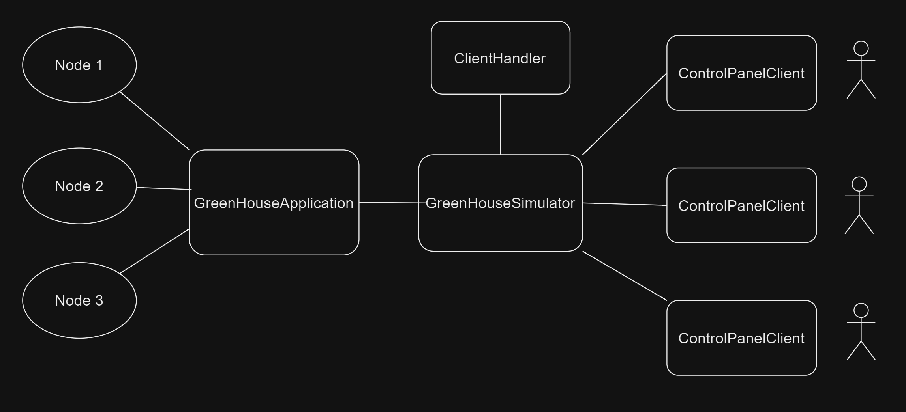

# Communication protocol

This document describes the protocol used for communication between the different nodes of the
distributed application.

## Terminology

* Sensor - a device which senses the environment and describes it with a value (an integer value in
  the context of this project). Examples: temperature sensor, humidity sensor.
* Actuator - a device which can influence the environment. Examples: a fan, a window opener/closer,
  door opener/closer, heater.
* Sensor and actuator node - a computer which has direct access to a set of sensors, a set of
  actuators and is connected to the Internet.
* Control-panel node - a device connected to the Internet which visualizes status of sensor and
  actuator nodes and sends control commands to them.
* Graphical User Interface (GUI) - A graphical interface where users of the system can interact with
  it.
* Server - a computer connected to the Internet which is used to relay messages between sensor and
  actuator nodes
* ControlPanelClient - a GUI which is used to interact with the system
* GreenHouseClient - a node in the greenhouse containing sensors and actuators

## The underlying transport protocol

The group choose to use TCP instead of UDP. TCP is a connection-oriented protocol which means that
a connection is established before any useful data is transferred. TCP provides features such as 
error-checking, acknowledgment of received data and retransmission of lost packets.
This ensures that each packet is delivered in the correct order and none is lost or duplicated.
In our greenhouse we need to be sure that each packet is delivered. For instance if one node turns on or off
an actuator, we need to be sure that the other nodes receive this information. TCP also has flow control 
which ensures that the sender doesn't overwhelm the receiver with data.

## Choosing of port number

When deciding which port number to use, the group wanted to have an unassigned port number. Ports above 1024
are usually available and not reserved for specific services. This also ensures that well-known ports like 80 (HTTP)
443 (HTTPS) or 22 (SSH) are not used. The group decided to use port 1234.

## The architecture

The architecture of the system is ControlPanelClient-GreenhouseSimulator-GreenHouseApplication. The ControlPanelClient
is the GUI where the user can interact with the system. The GreenhouseSimulator acts as the server and is connected
to the ClientHandler to handle requests from the ControlPanelClients. The GreenHouseApplication is the greenhouse
itself and keeps track of the currently active nodes.

IMPORTANT: The structure and architecture of the communication is highly inspired by group 15's solution and some places
identical.

## The flow of information and events
Establishing a connection:
1. The GreenhouseSimulator starts and waits for a connection from a ControlPanelClient.
2. The ControlPanelClient starts and connects to the GreenhouseSimulator.
3. The GreenhouseSimulator accepts the connection and creates a new ClientHandler thread.
4. The ClientHandler thread starts and waits for a message from the ControlPanelClient.
5. The ControlPanelClient sends a message to the GreenhouseSimulator.
6. The ClientHandler receives the message and sends it to the GreenHouseApplication.
7. The GreenHouseApplication receives the message and updates accordingly.

Each sensor inside the greenhouse updates every 5 seconds. This can be changed in the SensorActuatorNode
SENSING_DELAY constant. Once a sensor is updated the temperatureSensor chart within the node is updated.
When a ControlPanelClient sends a command such as turning on or off an actuator, then the ClientHandler
handles the command and sends it tt so the GreenHouseApplication.

## Connection and state
Our communication protocol is connection-oriented because they establish a connection before any useful data is transferred.
Our protocol is both stateful and stateless.
The GreenhouseSimulator is stateful because it keeps track of the connected nodes and the GreenHouseApplication is stateful
The GreenhouseApplication is stateful because it keeps 

## Types, constants

Value Types: Integer values for sensor and actuator data.

## Message format

Message format for creating a node:
1;2_window 4_heater

TODO - describe the general format of all messages. Then describe specific format for each 
message type in your protocol.

Format for Client sending Actuator updates: "actuator[" + actuatorId + "] on node " + nodeId + " is " + state

### Error messages

TODO - describe the possible error messages that nodes can send in your system.

Error messages:
"actuator not found"
"No actuator section for node " + nodeId
"Incorrect command format: " + rawCommand
"Error encrypting the command."
"Error sending command to actuator " + actuatorId + " on node " + nodeId + ": " + e.getMessage()  e = IOException
"Could not connect to server: " + e.getMessage() e = IOException
"Could not close connection: " + e.getMessage() e = IOException
"while reading from the socket: " + e.getMessage() e = IOException
"Incorrect command format: " + rawCommand
"An error occurred while stopping communication"
"TCP connection not established due to error : " + e.getMessage() e = IOException
"Could not accept client connection: " + e.getMessage() e = IOException
"Failed to toggle an actuator: " + e.getMessage() e = Exception
"Can't remove node " + nodeId + ", there is no Tab for it"
"No sensor section for node " + nodeId
* `ERROR: <error message>` - sent by the server to the client when an error occurs

## An example scenario

TODO - describe a typical scenario. How would it look like from communication perspective? When 
are connections established? Which packets are sent? How do nodes react on the packets? An 
example scenario could be as follows:

1. A sensor node with ID=1 is started. It has a temperature sensor, two humidity sensors. It can
   also open a window.
2. A sensor node with ID=2 is started. It has a single temperature sensor and can control two fans
   and a heater.
3. A control panel node is started.
4. Another control panel node is started.
5. A sensor node with ID=3 is started. It has a two temperature sensors and no actuators.
6. The user of the first-control panel presses on the button "ON" for the first fan of
   sensor/actuator node with ID=2.
7. The user of the second control-panel node presses on the button "turn off all actuators".

## Reliability and security

TODO - describe the reliability and security mechanisms your solution supports.
